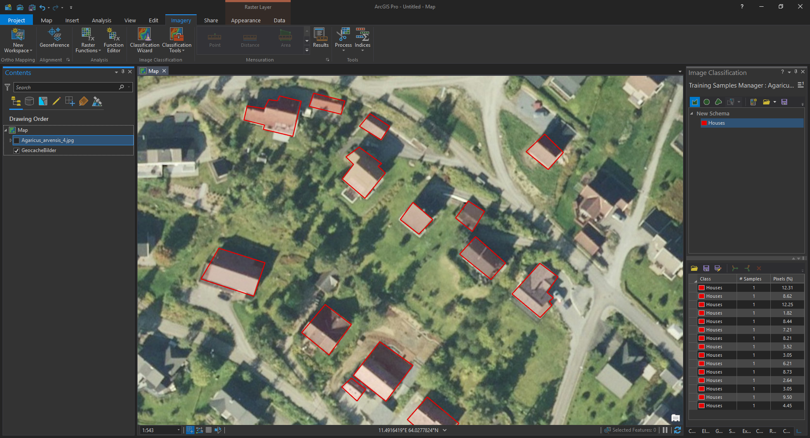
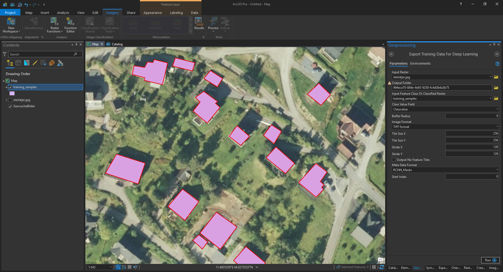

# Mask R-CNN for Object Detection and Segmentation in ArcGIS Pro

This is a fork of the original Mask R-CNN by matterport, see https://github.com/matterport/Mask_RCNN for installation, requirements etc..
Some additional scripts are added here which I used to train, evaluate and convert output from ArcGIS to use with matterport's version of Mask R-CNN

# Steps to do deep learning object detection in ArcGIS Pro

This is how I got the tool 'Detect objects using deep learning' in ArcGIS Pro to work using houses as an example.

## 1. Create masks over the objects of interest
Using the training samples manager, create masks over as many objects as possible, if your model is performing poorly, think about adding more training samples.

## 2. Export training data
Export the training data, using the tool 'Export training data for deep learning', I like to use tiff format, as it seems to perform slightly better then compressed jpg's. Set the tile and stride size, or leave them as default. Choose RCNN_Masks as the meta data format and export the tiles.

## 3. Use the ArcGIS2COCO.py script to convert samples to coco format
Change the base variables to fit your needs. The most important variable to change is the rootDir, change this to the output folder from step 2. I like to run python scripts from PyCharm, from which I can edit and run scripts within the same program. If using plane python, edit the file in a text editor and run 'python ArcGIS2COCO.py' from a cmd window.

## 4. Run the training script
Again, change the variables to your folders. Either use trainBaseModel.py or trainExtended.py.
The first one uses 500 training steps and 30 epochs and takes about one hour on a RTX2070 GPU with 1500 sample tiles.

## 5. Test the model
Using the script CalculateMAPIOU.py to get an mAP @ IuU score on the validation data. Again change the variables and folders to suite your needs and run the script.

## 6. Detect objects using deep learning
Change the .emd file to suit your needs, copy the trained .h5 file to the the root dir and change the 'ModelFile' parameter in the .emd file. Use the tool 'Detect objects using deep learning' and enter your raster to predict on, and your .emd file.

